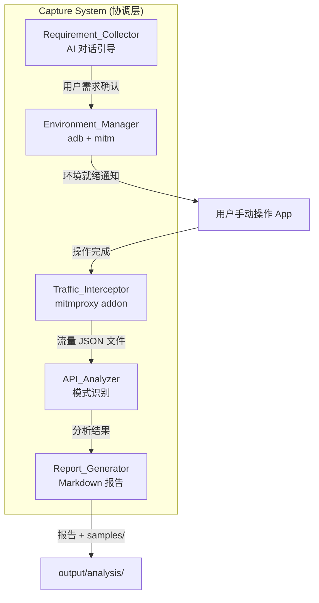

# 设计文档

## 概述

本设计文档描述 AI 辅助的通用移动端接口抓取与分析系统的技术架构和实现方案。系统采用模块化设计，核心流程分为四个阶段：需求收集与引导、环境准备、用户操作与流量录制、接口分析与报告生成。

系统不绑定任何特定 App，基于通用的响应结构模式进行接口类型识别。AI 负责引导用户明确目标、配置环境、分析流量；用户负责手动操作 App 触发接口。

## 技术栈

- **语言**: Python 3.11+
- **流量拦截**: mitmproxy (Python API 模式，mitmdump + addon)
- **设备管理**: adb (Android Debug Bridge)
- **数据存储**: JSON 文件
- **AI 分析**: LLM API（通过 AI 代理调用）
- **Skill 格式**: Markdown steering 文件

## 系统架构



```
┌─────────────────────────────────────────────────────────┐
│                    Capture System (协调层)                 │
├──────────────┬──────────────┬──────────────┬────────────┤
│ Requirement  │ Environment  │   Traffic    │   API      │
│ Collector    │ Manager      │ Interceptor  │  Analyzer  │
├──────────────┼──────────────┼──────────────┼────────────┤
│  AI 对话引导  │  adb + mitm  │  mitmproxy   │  模式识别   │
│              │              │  (addon)     │            │
└──────────────┴──────────────┴──────────────┴────────────┘
        │              │              │              │
        ▼              ▼              ▼              ▼
   用户需求确认    设备+代理环境    流量 JSON 文件   Report_Generator
                                                      │
                                                      ▼
                                              Markdown 报告 + samples/
```

## 组件与接口

### 1. Requirement_Collector 模块

**职责**: 引导用户明确抓取目标（App 名称、数据类型、操作页面）

**核心接口**:
```python
class RequirementCollector:
    def analyze_input(self, user_message: str) -> RequirementStatus
    def get_missing_fields(self, current: CaptureTarget) -> List[str]
    def generate_summary(self, target: CaptureTarget) -> str
    def is_complete(self, target: CaptureTarget) -> bool
```

**实现要点**:
- 解析用户输入，提取 app_name、target_data、operation_pages 三个必填字段
- 当字段缺失时，返回缺失字段列表供 AI 追问
- 当所有字段完整时，生成操作计划摘要
- 如果用户一次性提供完整信息，跳过逐步引导

### 2. Environment_Manager 模块

**职责**: 通过 adb 管理设备连接、证书安装、代理设置、mitmdump 启动

**核心接口**:
```python
class EnvironmentManager:
    async def check_device(self, device_id: str) -> ConnectionResult
    async def install_certificate(self, device_id: str) -> CertResult
    async def set_proxy(self, device_id: str, host: str, port: int) -> ProxyResult
    async def start_mitmdump(self, addon_path: str, port: int) -> ProcessResult
    async def cleanup(self, device_id: str) -> None
```

**实现要点**:
- 通过 `adb devices` 验证设备连接
- 使用 tmpfs overlay 方式安装 CA 证书到系统证书目录
- 通过 `adb shell settings put global http_proxy` 设置代理
- 启动 mitmdump 子进程并加载 capture_addon.py
- 每个步骤失败时返回具体错误信息和建议

### 3. Traffic_Interceptor 模块

**职责**: 通过 mitmproxy addon 捕获、过滤和存储网络流量

**核心接口**:
```python
class TrafficInterceptor:
    def __init__(self, storage_path: str, filter_rules: FilterRules):
        ...
    def start_recording(self) -> None
    def stop_recording(self) -> None
    def get_captured_requests(self) -> List[CapturedRequest]
    def get_stats(self) -> CaptureStats
```

**mitmproxy addon 设计**:
```python
class CaptureAddon:
    def __init__(self, storage_path: str, filter_rules: FilterRules):
        self.storage_path = storage_path
        self.filter_rules = filter_rules
        self.requests: List[CapturedRequest] = []

    def response(self, flow: http.HTTPFlow) -> None:
        if self._should_capture(flow):
            captured = self._flow_to_request(flow)
            self.requests.append(captured)
            self._save_to_json(captured)

    def _should_capture(self, flow: http.HTTPFlow) -> bool:
        # 4 层过滤逻辑
        if self._is_static_resource(flow):
            return False
        if self._is_blacklisted_domain(flow):
            return False
        if self._is_blacklisted_path(flow):
            return False
        if not self._matches_api_whitelist(flow):
            return False
        return True
```

**4 层过滤规则**:
1. **静态资源过滤**: Content-Type 为 image/、font/、video/、audio/、text/css、application/javascript
2. **域名黑名单**: 第三方 SDK 域名（数据上报、崩溃上报、广告、推送、性能监控等）
3. **路径黑名单**: 已知非业务路径（/sdk/app/、/reportBatchData、/track/v4 等）
4. **API 白名单**: Content-Type 含 json，或路径含 /api/、/v1/、/v2/、/v3/、/portal/、/gateway/

### 4. API_Analyzer 模块

**职责**: 基于通用响应结构模式识别接口类型，分析参数和数据链路

**核心接口**:
```python
class APIAnalyzer:
    def analyze_all(self, requests: List[CapturedRequest], target: CaptureTarget) -> AnalysisReport
    def classify_api_type(self, request: CapturedRequest) -> APIType
    def classify_parameters(self, request: CapturedRequest) -> List[ParameterInfo]
    def detect_data_links(self, results: List[APIAnalysisResult]) -> List[DataLink]
```

**通用接口类型识别规则**（不绑定特定字段名）:

| 接口类型 | 识别规则 |
|----------|----------|
| LIST | 响应含数组，数组元素为结构化对象（含 id 字段 + 至少一个名称/标题类字段） |
| PAGINATION | 请求含分页参数（page/offset/cursor/pageFlag），响应含分页标识（hasMore/total/nextPage/nextCursor） |
| DETAIL | 请求含 id 参数，响应字段数量明显多于列表元素（>1.5 倍） |
| MEDIA | 响应含媒体 URL 模式（.mp4/.m3u8/.mp3 或路径含 video/play/stream/media） |
| CONFIG | 响应含 config/settings/version 等配置字段 |
| AUX | 响应为简单值或状态码，不属于以上类型 |

**参数分类规则**（通用）:

| 类型 | 判断规则 |
|------|----------|
| static | version, platform, os, brand, model, channel, appVersion 等固定值 |
| session | token, userId, session, uid, authorization 等用户身份标识 |
| dynamic | sign, nonce, timestamp, signature 等每次请求值不同的参数 |

**数据链路检测**:
- 从 LIST 类型接口响应中提取 ID 字段值
- 检查 DETAIL 或 MEDIA 类型接口请求中是否使用了该 ID
- 建立接口间的调用链（如 list → detail → media）

### 5. Report_Generator 模块

**职责**: 将分析结果输出为结构化 Markdown 报告和请求样本文件

**核心接口**:
```python
class ReportGenerator:
    def generate(self, report: AnalysisReport, output_dir: str) -> ReportOutput
    def generate_curl(self, request: CapturedRequest) -> str
    def save_samples(self, results: List[APIAnalysisResult], samples_dir: str) -> List[str]
    def render_markdown(self, report: AnalysisReport) -> str
```

**报告内容结构**:
1. 抓取目标摘要
2. 数据链路图（接口间调用关系）
3. 接口概览表（路径、用途、类型、调用次数、是否匹配用户目标）
4. 每个接口详情：
   - 请求参数表（参数名 + 类型 + 示例值）
   - 响应结构概览
   - 列表数据的第一条记录字段示例
   - 完整响应引用（指向 samples/ 目录）
   - cURL 命令
5. 签名机制说明
6. 采集策略建议

## 数据模型

### CaptureTarget（抓取目标）

```python
@dataclass
class CaptureTarget:
    app_name: str              # 目标 App 名称
    target_data: str           # 期望获取的数据描述
    operation_pages: str       # 需要操作的页面说明
    filter_domains: Optional[List[str]] = None  # 用户指定的域名白名单
```

### FilterRules（过滤规则）

```python
@dataclass
class FilterRules:
    content_type_blacklist: List[str]   # Content-Type 黑名单（image/、font/ 等）
    domain_blacklist: List[str]         # 域名黑名单（SDK、广告等）
    path_blacklist: List[str]           # 路径黑名单（/sdk/app/ 等）
    content_type_whitelist: List[str]   # Content-Type 白名单（json）
    api_path_patterns: List[str]        # API 路径模式白名单（/api/、/v1/ 等）
    user_domain_whitelist: Optional[List[str]] = None  # 用户指定的域名白名单
    user_domain_blacklist: Optional[List[str]] = None  # 用户指定的域名黑名单
```

### CapturedRequest（捕获的请求）

```python
@dataclass
class CapturedRequest:
    id: str                    # 唯一标识
    timestamp: datetime        # 捕获时间
    method: str                # HTTP 方法
    url: str                   # 完整 URL
    headers: dict              # 请求头
    body: Optional[str]        # 请求体（文本形式）
    response_status: int       # 响应状态码
    response_headers: dict     # 响应头
    response_body: Optional[str]  # 响应体（文本形式）
    is_decrypted: bool         # 是否成功解密 HTTPS
```

### ParameterInfo（参数信息）

```python
@dataclass
class ParameterInfo:
    name: str                  # 参数名
    value_sample: str          # 样本值
    category: str              # 分类: static, session, dynamic
    source: str                # 来源位置: query, header, body, cookie
```

### APIType（接口类型枚举）

```python
class APIType(Enum):
    LIST = "list"
    PAGINATION = "pagination"
    DETAIL = "detail"
    MEDIA = "media"
    CONFIG = "config"
    AUX = "aux"
```

### APIAnalysisResult（接口分析结果）

```python
@dataclass
class APIAnalysisResult:
    request_id: str            # 关联的请求 ID
    endpoint: str              # 接口路径
    api_type: APIType          # 接口类型
    parameters: List[ParameterInfo]  # 参数分析列表
    has_signature: bool        # 是否包含动态签名
    signature_fields: List[str]  # 签名相关字段名
    matches_target: bool       # 是否匹配用户目标
    call_count: int            # 调用次数
```

### DataLink（数据链路）

```python
@dataclass
class DataLink:
    source_endpoint: str       # 源接口路径
    target_endpoint: str       # 目标接口路径
    link_field: str            # 关联字段名（如 id）
    link_type: str             # 链路类型: list_to_detail, list_to_media, detail_to_media
```

### AnalysisReport（分析报告）

```python
@dataclass
class AnalysisReport:
    target: CaptureTarget      # 抓取目标
    results: List[APIAnalysisResult]  # 所有接口分析结果
    data_links: List[DataLink]  # 数据链路
    total_captured: int        # 总捕获请求数（过滤前）
    total_analyzed: int        # 分析的接口数（过滤后）
    target_matched: int        # 匹配用户目标的接口数
    generated_at: datetime     # 报告生成时间
```

## 正确性属性

*A property is a characteristic or behavior that should hold true across all valid executions of a system—essentially, a formal statement about what the system should do. Properties serve as the bridge between human-readable specifications and machine-verifiable correctness guarantees.*

### Property 1: 请求存储 Round-Trip

*For any* valid CapturedRequest object, serializing it to JSON and then deserializing should produce an equivalent object with all fields preserved.

**Validates: Requirements 3.6**

### Property 2: 过滤规则不变量

*For any* list of CapturedRequest objects and any FilterRules configuration, every request that passes the filter must satisfy: its Content-Type is not in the blacklist, its domain is not in the domain blacklist, its path is not in the path blacklist, AND it matches the API whitelist criteria (Content-Type contains json OR path matches known API patterns).

**Validates: Requirements 4.1, 4.2, 4.3, 4.4**

### Property 3: 参数分类一致性

*For any* ParameterInfo produced by the analyzer, its category must be exactly one of: "static", "session", or "dynamic". The classification must be deterministic — the same parameter name and value characteristics always produce the same category.

**Validates: Requirements 5.3**

### Property 4: 时间戳单调递增

*For any* sequence of CapturedRequest objects captured during a single recording session, when sorted by capture order, their timestamps must be monotonically non-decreasing.

**Validates: Requirements 3.3**

### Property 5: 报告数据一致性

*For any* AnalysisReport, the total number of analyzed APIs must equal the sum of APIs classified as each type: count(LIST) + count(PAGINATION) + count(DETAIL) + count(MEDIA) + count(CONFIG) + count(AUX) == total_analyzed.

**Validates: Requirements 6.2**

### Property 6: 接口类型识别一致性

*For any* CapturedRequest classified as LIST type, its response body must contain an array of structured objects. *For any* CapturedRequest classified as PAGINATION type, its request must contain at least one pagination parameter (page/offset/cursor/pageFlag).

**Validates: Requirements 5.2**

### Property 7: 缺失字段检测

*For any* CaptureTarget with one or more required fields (app_name, target_data, operation_pages) set to empty/None, the RequirementCollector.get_missing_fields() must return a non-empty list containing exactly those missing field names.

**Validates: Requirements 1.2, 1.3, 1.4**

### Property 8: cURL 命令正确性

*For any* CapturedRequest, the generated cURL command must contain the correct HTTP method, the complete URL, and all non-trivial request headers from the original request.

**Validates: Requirements 6.3**

### Property 9: 数据链路检测

*For any* set of APIAnalysisResult where a LIST-type API's response contains ID values that appear as request parameters in a DETAIL-type or MEDIA-type API, the detect_data_links function must identify and return this relationship.

**Validates: Requirements 5.4**

## 错误处理

### 环境准备阶段

| 错误场景 | 处理方式 |
|----------|----------|
| 设备未连接 | 返回设备标识和连接失败原因，建议检查 adb 连接 |
| CA 证书安装失败 | 返回具体原因，提供手动安装指引（需要 root 权限） |
| 代理设置失败 | 返回错误信息，建议检查设备网络设置权限 |
| mitmdump 启动失败 | 返回失败原因，建议检查端口占用（`lsof -i :8080`） |
| mitmdump 进程异常退出 | 检测进程状态，提示用户重新启动 |

### 流量录制阶段

| 错误场景 | 处理方式 |
|----------|----------|
| HTTPS 解密失败 | 记录 URL 并标记 is_decrypted=False，不中断录制 |
| 磁盘空间不足 | 警告用户，建议清理空间或停止录制 |
| JSON 写入失败 | 重试一次，仍失败则记录错误日志并跳过该请求 |

### 分析阶段

| 错误场景 | 处理方式 |
|----------|----------|
| 无捕获数据 | 提示用户可能未正确操作或代理未生效 |
| 响应体解析失败 | 跳过该请求，标记为 AUX 类型 |
| 未找到匹配目标的接口 | 在报告中明确说明，列出所有已识别的业务接口 |

## 测试策略

### 属性测试（Property-Based Testing）

使用 **Hypothesis** 库进行属性测试，每个属性测试运行最少 100 次迭代。

**适用范围**:
- 数据序列化/反序列化（Round-Trip）
- 过滤规则逻辑（不变量）
- 参数分类逻辑（一致性）
- 接口类型识别逻辑（结构模式匹配）
- 报告数据统计（计数一致性）
- cURL 命令生成（正确性）

**测试标签格式**: `Feature: ai-api-capture, Property {number}: {property_text}`

### 单元测试（Example-Based）

- 需求收集模块：完整输入跳过引导、缺失字段引导
- 环境管理模块：各步骤成功/失败场景（mock adb）
- 过滤规则：具体域名/路径/Content-Type 的过滤效果
- 接口分类：具体 JSON 响应结构的分类结果
- 报告生成：报告格式和内容完整性

### 集成测试

- 完整流程：从流量 JSON 文件到分析报告的端到端测试
- mitmproxy addon：使用 mock flow 测试 addon 的过滤和存储逻辑
- 环境管理：使用 mock subprocess 测试 adb/mitmdump 命令执行

## 文件结构

```
ai-api-capture/
├── src/
│   ├── __init__.py
│   ├── capture_system.py        # 主协调器
│   ├── requirement_collector.py # 需求收集与引导
│   ├── environment_manager.py   # 环境管理（adb + mitm）
│   ├── traffic_interceptor.py   # 流量拦截
│   ├── api_analyzer.py          # 接口分析（通用模式识别）
│   ├── report_generator.py      # 报告生成
│   ├── models.py                # 数据模型
│   └── storage.py               # 数据存储
├── addons/
│   └── capture_addon.py         # mitmproxy addon 脚本
├── skill/
│   └── ai-api-capture.md        # 通用 skill 指令文件
├── output/
│   ├── captures/                # 捕获的流量 JSON
│   └── analysis/                # 分析报告 + samples
│       └── samples/             # 请求/响应 JSON 样本
├── tests/
│   ├── __init__.py
│   ├── test_models.py           # 数据模型测试
│   ├── test_requirement_collector.py  # 需求收集测试
│   ├── test_environment_manager.py    # 环境管理测试
│   ├── test_traffic_interceptor.py    # 流量拦截测试
│   ├── test_api_analyzer.py     # 接口分析测试
│   ├── test_report_generator.py # 报告生成测试
│   ├── test_filter_property.py  # 过滤规则属性测试
│   ├── test_analyzer_property.py # 分析器属性测试
│   ├── test_storage.py          # 存储测试
│   └── test_integration.py      # 集成测试
├── pyproject.toml
└── README.md
```

## 关键设计决策

1. **不使用 Mobile MCP 操控设备**: 用户手动操作 App 更灵活、更可靠，避免了 UI 自动化的脆弱性和兼容性问题。AI 只负责环境准备和流量分析。

2. **mitmproxy 使用 addon 模式**: 通过 mitmdump + addon 脚本实现流量捕获，便于实时过滤和存储，支持动态调整过滤规则。

3. **通用接口识别（不绑定特定字段名）**: 基于响应结构的通用模式（数组、分页标识、ID 参数等）识别接口类型，适用于任意 App。

4. **4 层过滤减少噪音**: 在捕获阶段就排除无关流量（静态资源、SDK、非业务路径），减少后续分析的数据量和 token 消耗。

5. **报告而非代码生成**: 输出结构化的 Markdown 报告 + cURL 命令 + JSON 样本，供其他 AI 或开发者参考，比生成代码更通用、更灵活。

6. **JSON 文件存储**: 简单直接，无需数据库依赖，便于查看和调试。每个请求独立存储，支持增量写入。

7. **AI 引导式需求收集**: 当用户需求不清晰时主动引导，确保后续分析能精准聚焦在用户关心的接口上。
